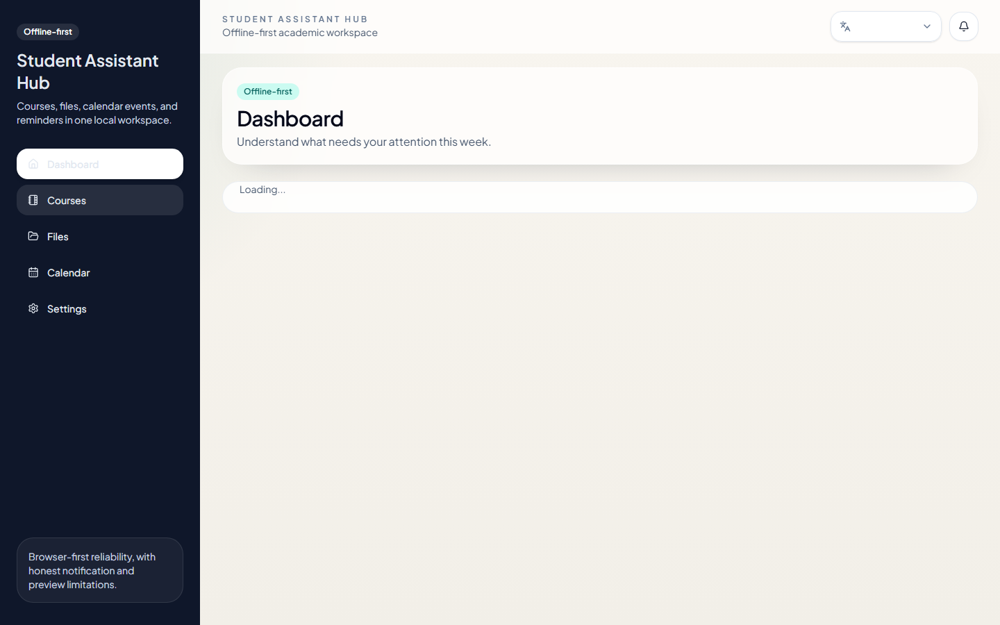

# Student Assistant Hub

Offline-first student workspace for courses, files, calendars, reminders, summaries, and study quizzes. The application runs in the browser and stores user data in IndexedDB.



## What it does

- organizes courses, files, deadlines, events, and reminders
- extracts text from supported local documents
- builds deterministic summaries from document structure and scored concepts
- creates local study quizzes from extracted text and concepts
- records quiz attempts and detects stale study material after a source file changes
- imports calendar feeds through a narrow same-origin proxy
- exports and restores browser-held workspace data
- supports English and French interfaces

## How the study tools work

The current implementation does not call an LLM, Ollama, embeddings service, or paid AI API. Text extraction feeds deterministic TypeScript services that rank concepts, select sentences, build summary sections, and generate quiz candidates. The same input and application version produce explainable local results.

## Architecture

```text
Next.js UI
   │
   ├── application services (ingestion, summaries, quizzes, calendar)
   │
   ├── repositories
   │      └── Dexie / IndexedDB
   │
   └── same-origin calendar proxy
```

Data stays in the current browser profile unless the user exports it. There is no account system, cloud synchronization, or server-side workspace database.

## Stack

TypeScript, Next.js, React, Dexie, IndexedDB, Tailwind CSS, Vitest, Testing Library, and Playwright.

## Local setup

Requirements: Node.js 20 or newer.

```bash
npm ci
npm run dev
```

Open `http://localhost:3000`.

## Quality checks

```bash
npm run lint
npm test
npm run build
npm run verify
npm run verify:full   # includes Playwright; browser installation is required
```

The GitHub Actions workflow runs the deterministic `npm run verify` gate on every push and pull request.

## Storage, backup, and limitations

- Browser storage can be cleared by the user, browser policy, or device cleanup.
- Data does not synchronize between browsers or devices.
- Exported backups may contain user-provided academic content and should be handled privately.
- Image-only PDFs require OCR before their text can be summarized.
- Calendar import depends on the remote feed and the local proxy route.
- Generated summaries and quizzes are study aids based on deterministic heuristics; they are not authoritative academic answers.

## Repository map

- `app/`: routes and page composition
- `components/`: reusable interface components
- `lib/db/`: IndexedDB schema and migrations
- `lib/repositories/`: storage boundaries
- `lib/services/`: ingestion, summary, quiz, and calendar logic
- `tests/`: unit and component regression coverage
- `e2e/`: browser workflows
- `docs/`: technical detail

## Status

Active portfolio project. Core flows are implemented and covered by automated tests. It is designed for local single-user use and has no hosted multi-user backend.

## License

MIT. See [LICENSE](LICENSE).
